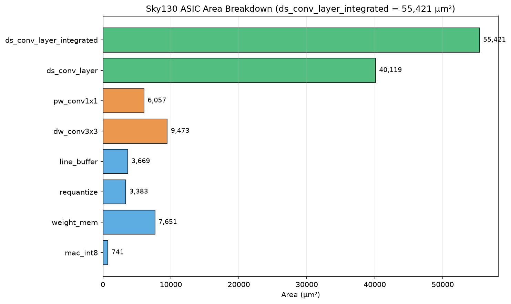
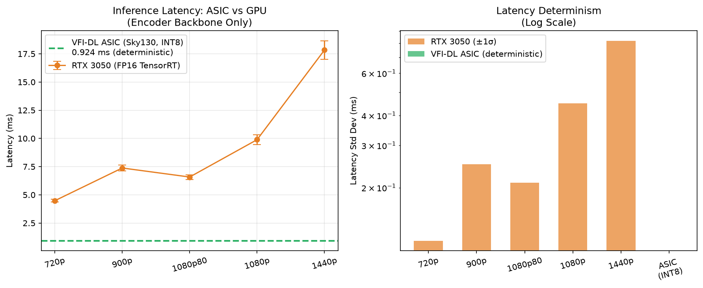
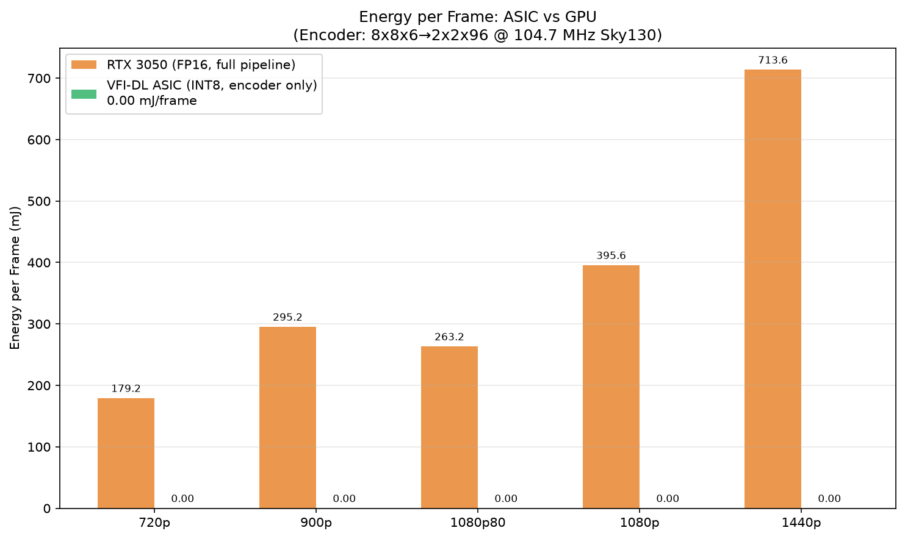

# VFI-DL

An INT8 CNN inference datapath for real-time video frame interpolation, written in Verilog.

This is the hardware for **Open-Frame-gen**, a frame interpolation model I published at JCSSE 2026. The repo builds the model's compute-heavy parts as a small, weight-reloadable fixed-function engine: a depthwise-separable encoder that runs the CNN backbone, plus a warp+blend stage (bilinear grid_sample and mask blend) that turns two input frames into an interpolated one. Everything is hand-written RTL, verified cycle-by-cycle against numpy references, and synthesized on an Artix-7 XC7A100T with Vivado 2026.1.

## Layout

```
rtl/       Verilog RTL
golden/    numpy references — define the exact INT8 numerics the RTL must match
tb/        cocotb testbenches (one per module)
syn/       synthesis flow (Vivado 2026.1; historical Yosys/Sky130 scripts kept)
tools/     vfi_demo.py — two frames in, interpolated frame out
samples/   demo frames
reports/   writeup with measured numbers
docs/      architecture notes, roadmap, benchmarking methodology
```

## Running the tests

```
./run_all_tests.sh
```

Runs every cocotb suite in dependency order. Each suite drives the RTL and the numpy golden model in lockstep and compares outputs every cycle — any mismatch fails the run with the exact cycle and values.

## Demo

```
python3 tools/vfi_demo.py --t samples/frame_t.png --t1 samples/frame_t1.png --out out/mid.png --rtl
```

Runs the INT8 RTL path and reports PSNR against the FP16 ONNX reference. On the
bundled sample frames:

| Input frame t | Input frame t1 | Interpolated mid (RTL INT8, 54.7 dB vs FP16) |
|---|---|---|
|  |  |  |

## Measured on hardware

Synthesized with **Vivado 2026.1** on an Artix-7 XC7A100T (100 MHz constraint).
Utilization, worst negative slack and Fmax for every module:


FPGA area per stage and the latency/energy plots from the benchmarking
writeup (`reports/VFI_DL_Report.md`, `docs/BENCHMARKING.md`):





## Numerics

INT8 activations and weights (symmetric, per-tensor), INT32 accumulation, TFLite-style requantization with round-half-up and clamp to `[-128, 127]`. The numpy golden in `golden/` is the authoritative definition of the rounding; the RTL matches it bit-for-bit.

## Status

The encoder and warp+blend datapaths are both verified (all suites pass). Synthesis and measured numbers are tracked in `docs/ROADMAP.md`; the technical writeup is `reports/VFI_DL_Report.md`.
