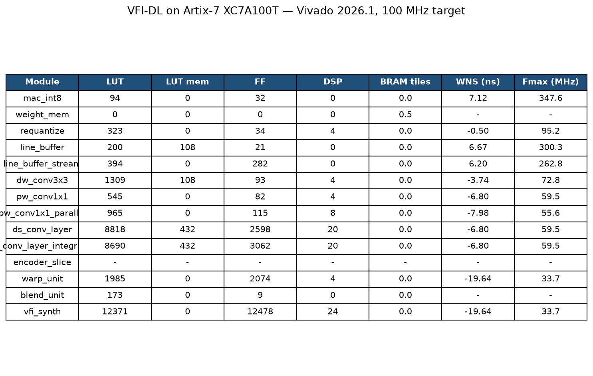

# VFI-DL

An INT8 CNN inference datapath for real-time video frame interpolation, written in Verilog.

This is the hardware for **[Open-Frame-gen](https://github.com/Deadly-pro/Open-Frame-gen)**, a frame interpolation model I published at JCSSE 2026. The repo builds the model's compute-heavy parts as a small, weight-reloadable fixed-function engine: a depthwise-separable encoder that runs the CNN backbone, plus a warp+blend stage (bilinear grid_sample and mask blend) that turns two input frames into an interpolated one. Everything is hand-written RTL, verified cycle-by-cycle against numpy references, and synthesized on an Artix-7 XC7A100T with Vivado 2026.1.

**Why this exists.** Frame interpolation is the engine behind DLSS 3 / FSR 3 Frame Generation — but on a GPU it runs on tensor cores at full-datacenter-style cost. This repo shows the compute-heavy parts of that same workload (the CNN backbone + warp/blend) as a small, weight-reloadable INT8 fixed-function engine that runs deterministically on an FPGA. It demonstrates the architecture for adding temporal interpolation to constrained hardware; it is not a shipping GPU feature.

## Layout

```
rtl/       Verilog RTL
golden/    numpy references — define the exact INT8 numerics the RTL must match
tb/        cocotb testbenches (one per module)
syn/       synthesis flow (Vivado 2026.1; historical Yosys/Sky130 scripts kept)
tools/     vfi_demo.py — two frames in, interpolated frame out
samples/   demo frames
reports/   writeup with measured numbers
docs/      architecture notes, roadmap, benchmarking methodology
```

## Running the tests

```
./run_all_tests.sh
```

Runs every cocotb suite in dependency order. Each suite drives the RTL and the numpy golden model in lockstep and compares outputs every cycle — any mismatch fails the run with the exact cycle and values.

## Demo

```
python3 tools/vfi_demo.py --t samples/frame_t.png --t1 samples/frame_t1.png --out out/mid.png --rtl
```

Runs the INT8 RTL path and reports PSNR against the FP16 ONNX reference. On a
Vimeo-90K test triplet (448x256):

| Input frame t | Ground-truth middle (t+0.5) | Input frame t+1 |
|---|---|---|
|  |  |  |

Interpolated by the RTL warp+blend (INT8):


On this sequence the INT8 output matches its FP16 reference at 50.8 dB, and
the INT8 quantization delta against the ground truth is unmeasurable — both
paths score 26.4 dB vs the ground-truth middle frame.

## Measured on hardware

Synthesized with **Vivado 2026.1** on an Artix-7 XC7A100T (100 MHz constraint).
Utilization, worst negative slack and Fmax for every module:



## Numerics

INT8 activations and weights (symmetric, per-tensor), INT32 accumulation, TFLite-style requantization with round-half-up and clamp to `[-128, 127]`. The numpy golden in `golden/` is the authoritative definition of the rounding; the RTL matches it bit-for-bit.

## Status

The encoder and warp+blend datapaths are both verified (all suites pass). Synthesis and measured numbers are tracked in `docs/ROADMAP.md`; the technical writeup is `reports/VFI_DL_Report.md`.
